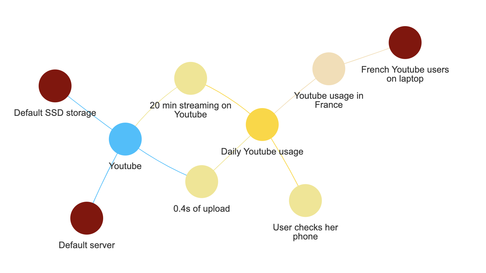

# E-footprint model

A toolkit for exhaustively modeling the environmental impact of digital services.

The current perimeter is the carbon footprint associated with the fabrication and usage of servers, storage, network (usage only) and end-user devices necessary for the existence of a digital service. Other environmental impacts (water, rare earth metals, etc.) will be added soon through an integration with the [Boavizta API](https://github.com/Boavizta/boaviztapi), and the lifecycle phases of device transportation and end of life are currently considered negligible.

# Getting started

## Documentation

Here is the link to the [e-footprint documentation](https://publicissapient-france.github.io/e-footprint). There you will find a description of all the e-footprint objects, their parameters, the relationship between the objects and the calculated attributes and their graphs.

## Didactic interface

You can explore the model’s [didactic interface](https://publicis-sapient-e-footprint-model.streamlit.app/). This interface allows for a limited use of the model, with only one user journey on a single service when the code allows for an unlimited amount of objects. The goal is to let users discover the inputs and explore the calculation graphs (see below).

## Modeling examples

Checkout our open source [e-footprint modeling use cases](https://github.com/publicissapient-france/e-footprint-modelings).

## Tutorial

    pip install efootprint

You can then run the [jupyter notebook tutorial](tutorial.ipynb) to familiarize yourself with the object logic and generate an object relationship graph and a calculation graph as HTML files in the current folder.

<figure>
    
    <figcaption>Object relationships graph: usage pattern in purple, user journey and user journey steps in gold, hardware in red, and service in blue. Hover over a node to get the numerical values of its environmental and technical attributes. For simplifying the graph the Network and Hardware nodes are not shown.</figcaption>
</figure>

<figure>
    
    <figcaption>Calculation graph: user inputs in gold, hypothesis in darkred, and intermediate calculations in pale blue. Hover over a node to read the formula.</figcaption>
</figure>

### To launch jupyter:

```sh
# Todo once to setup jupyter kernel
poetry run ipython kernel install --user --name=efootprint-kernel
# Start Jupyter server with poetry
poetry run jupyter notebook tutorial.ipynb
```

## Dev setup

Check out [INSTALL.md](./INSTALL.md).

# Code logic

The code has been architectured to separate modeling from optimization from API logic. The goal is to make contribution to the modeling logic as straightforward as possible.

- Scripts that deal with modeling logic are located in [efootprint/core](./efootprint/core).
- Optimizations (having the model rerun the right calculations whenever an input attribute or a link between objects changes) are dealt with in [efootprint/abstract_modeling_classes](./efootprint/abstract_modeling_classes).
- The API doesn’t exist yet but will be also decoupled from the modeling and optimization logics.

# Contributing

Check out [CONTRIBUTING.md](./CONTRIBUTING.md)

# License

[GNU Affero General Public License v3.0](./LICENSE)
