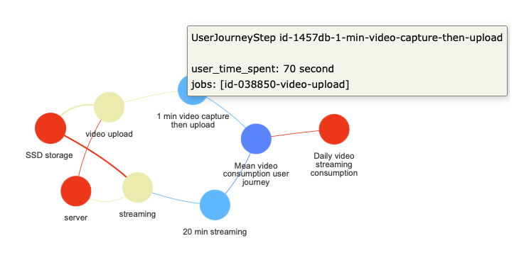
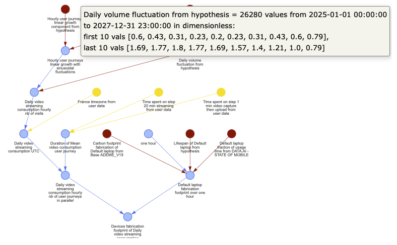

# E-footprint model

A toolkit for exhaustively modeling the environmental impact of digital services.

The current perimeter is the carbon footprint associated with the fabrication and usage of servers, storage, network (usage only) and end user devices necessary for the existence of a digital service. Other environmental impacts (water, rare earth metals, etc.) will be added soon through an integration with the [Boavizta API](https://github.com/Boavizta/boaviztapi), and the lifecycle phases of device transportation and end of life are currently considered negligible.

# Getting started
## Quickstart

    pip install efootprint

You can then run the [quickstart](quickstart.py) script to familiarize yourself with the object logic and generate an object relationship graph and a calculation graph as html files in the ./images folder.

<figure>
    
    <figcaption>Object relationships graph: usage objects in green, hardware in brown, and service in blue</figcaption>
</figure>

<figure>
    
    <figcaption>Calculus graph: user inputs in green, hypothesis in red, and intermediate calculations in pale blue. Hover over a node to read the formula.</figcaption>
</figure>

## Dev setup
Check out [INSTALL.md](./INSTALL.md).

# Code logic
The code has been architectured to separate modeling from optimization from API logic. The goal is to make contribution to the modeling logic as straightforward as possible.

- Scripts that deal with modeling logic are located in [efootprint/core](./efootprint/core).
- Optimizations (having the model rerun the right calculations whenever an input attribute or a link between objects changes) are dealt with in [efootprint/abstract_modeling_classes](./efootprint/abstract_modeling_classes).
- The API doesn’t exist yet but will be also decoupled from the modeling and optimization logics.

# Contributing
Check out [CONTRIBUTING.md](./CONTRIBUTING.md)

# License
[GNU Affero General Public License v3.0](./LICENSE)